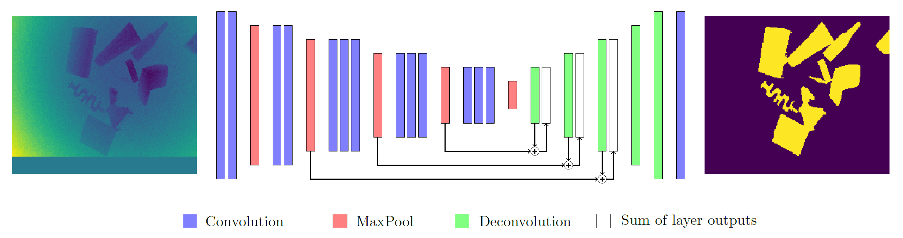

# Semantic Segmentation of Depth Images for Robotic Grasping

<p align="center">
  <a href="https://github.com/JoachimColine/segmentation-of-depth-images">
    
  </a>
</p>

I am willing to share an academic project I carried out during my last year at University of Liège. 
I hope it may help or inspire future depth data segmentation projects!

## Description
In this work I present a complete pipeline for building and training a fully convolutional neural network that is able to perform 
binary semantic segmentation of depth images. In particular, I focus on the problem of distinguishing objects from the 
background in depth data collected from a Time-Of-Flight (TOF) 3D sensor. Pixel-wise object detection is especially useful 
in robotic grasping tasks where correctly understanding a scene is key to reducing the risks of unwanted interactions. 
To tackle the problem of labelling many depth images by hand, I introduce a method for automatically generating many 
labelled depth images through simulations of both the scene and the noise pattern of the sensor. I show that under 
certain assumptions regarding the environment, my model is able to fulfill its task with great success on new synthetic 
images, but has yet to be improved for correctly dealing with real captures.

## Cite this repository 
```
@misc{Coline2020,
  author = {Coline, J.},
  title = {Semantic Segmentation of Depth Images for Robotic Grasping},
  year = {2020},
  publisher = {GitHub},
  journal = {GitHub repository},
  howpublished = {\url{https://github.com/joachimcoline/segmentation-of-depth-images}}
}
```